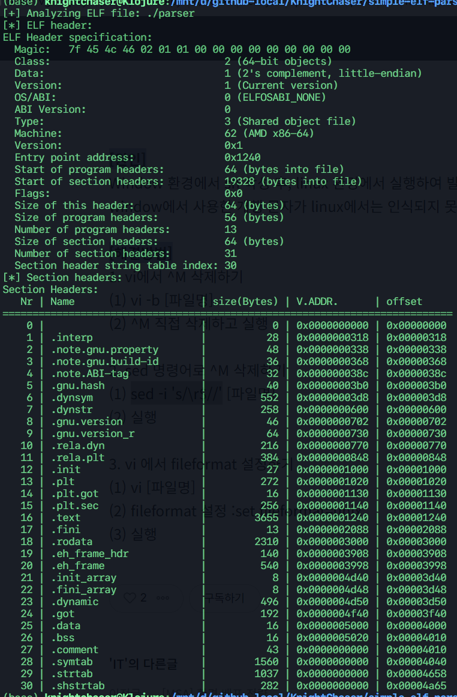

# simple-elf-parser

### A simple Linux ELF(Executable &amp; Linkable Format) parser implemented in C language, with using standard Linux APIs.

### Build
It's so simple, even making `Makefile` seems unnecessary. Run `run.sh` to compile  and test the program with an argument as the compiled program itself